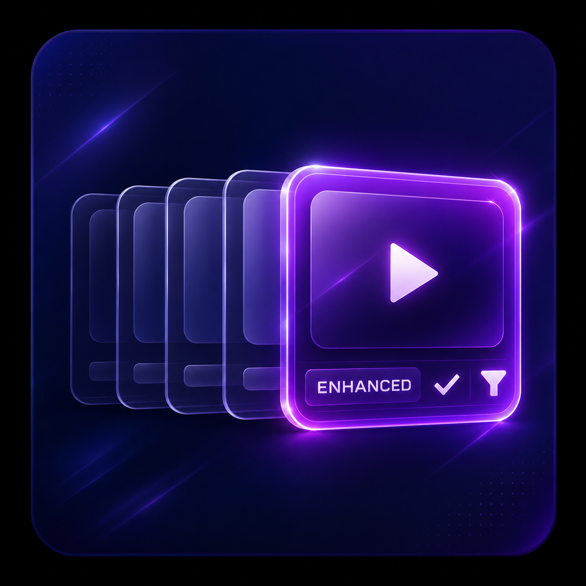

<p align="center">
  
</p>

<h1 align="center">Continue Watching Deduplicator Enhanced</h1>

A server-side Jellyfin plugin that deduplicates **Continue Watching** and can
optionally deduplicate **Up Next**, including hiding a series from Up Next while
the same series is already present in Continue Watching.

This is an independent fork of
[SloMR/jellyfin-plugin-dedupe-continue-watching](https://github.com/SloMR/jellyfin-plugin-dedupe-continue-watching),
with its own plugin GUID, assembly name, configuration and release feed. It can
therefore be installed independently, although running both plugins at once is
not recommended because both modify Continue Watching responses.

## Features

- Deduplicates episodes by `SeriesId`
- Keeps the most recently played episode per series by default
- Optional cross-section deduplication for Up Next
- Supports standard Jellyfin and Home Screen Sections endpoints
- Handles gzip, Brotli and deflate responses
- Fails open and returns the original response if processing fails
- Does not modify playback progress or other stored user data

## Installation

Add this URL under **Dashboard → Plugins → Repositories**:

```text
https://raw.githubusercontent.com/philipkraeutl/jellyfin-plugin-dedupe-continue-watching-enhanced/main/manifest.json
```

Then install **Continue Watching Deduplicator Enhanced** from the catalog and
restart Jellyfin.

For manual installation, download a release zip and extract the DLL into a
versioned directory below Jellyfin's `plugins` directory.

## Configuration

The configuration appears as **Continue Watching Deduplicator Enhanced** in
Jellyfin's dashboard navigation and on the installed plugin page.

| Setting | Default | Description |
|---|---:|---|
| Enable deduplication | `true` | Enables response processing |
| Deduplicate Up Next | `false` | Deduplicates Up Next and hides series already present in Continue Watching |
| Deduplicate movies | `false` | Deduplicates multiple versions of the same movie |
| Max episodes per series | `1` | Number of most recently played episodes retained per series |

## Intercepted endpoints

- `/Users/{userId}/Items/Resume`
- `/UserItems/Resume`
- `/Shows/Resume`
- `/HomeScreen/Section/ContinueWatching`
- `/Shows/NextUp` when Up Next deduplication is enabled
- `/HomeScreen/Section/NextUp` when Up Next deduplication is enabled

## Building

Requires the .NET 8 SDK.

```bash
dotnet publish Jellyfin.Plugin.ContinueWatchingDedupEnhanced/Jellyfin.Plugin.ContinueWatchingDedupEnhanced.csproj -c Release -o dist
```

The output is `Jellyfin.Plugin.ContinueWatchingDedupEnhanced.dll`. See
[BUILDING.md](BUILDING.md) for installation and release details.

## Releases

Push a four-part version tag such as `v1.0.0.0`. The release workflow builds
and packages the enhanced DLL, creates a GitHub release, calculates its MD5
checksum and opens a pull request that adds the release to `manifest.json`.

## Compatibility

- Jellyfin 10.10.x: stable `net8.0` build, target ABI `10.10.0.0`
- Jellyfin 12.0 RC3: preview `net10.0` build, target ABI `12.0`

Releases contain separate ZIP files for both server generations. Jellyfin's
plugin catalog selects the entry matching the server ABI. The Jellyfin 12 build
is a preview and should be tested on non-production servers.

## License

[GPL-3.0](LICENSE)
